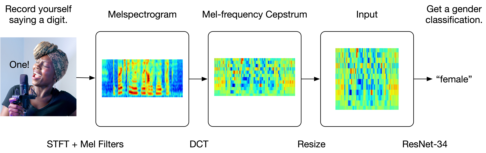
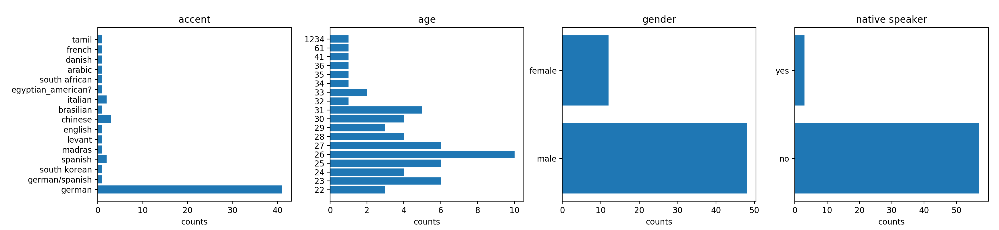
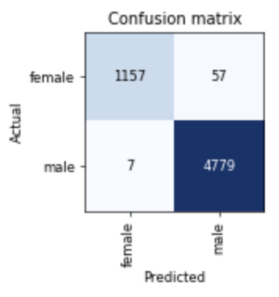
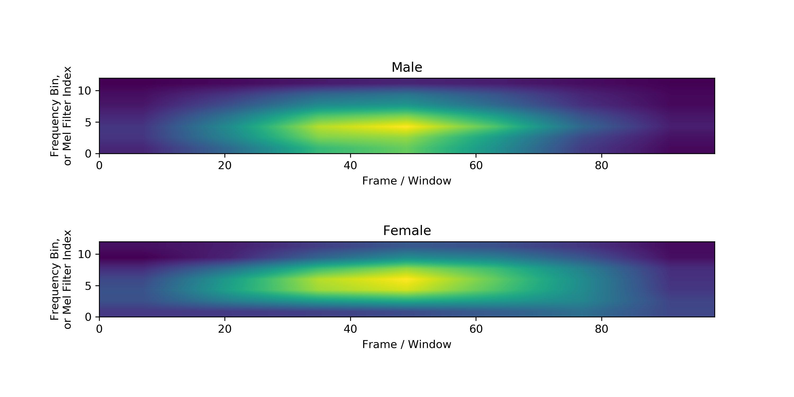
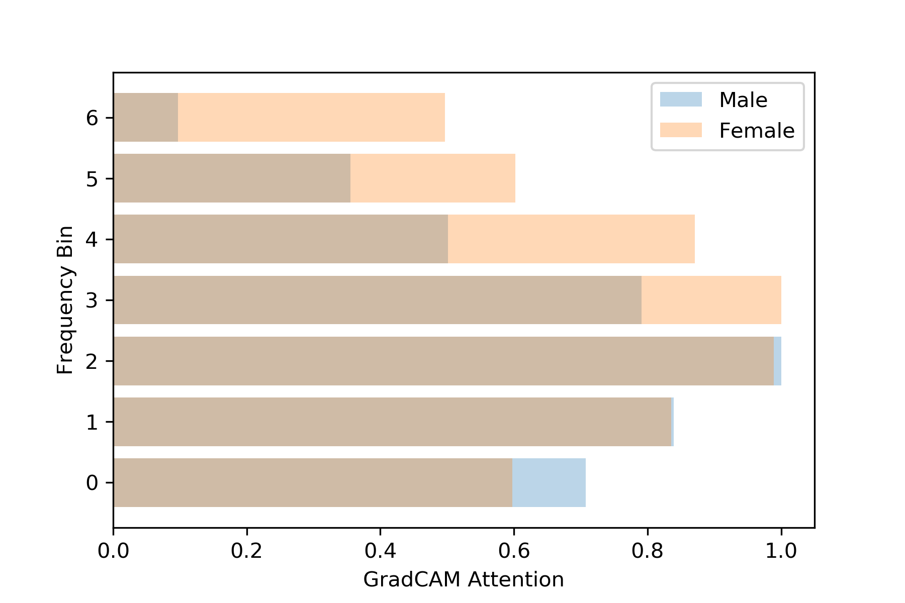

# Speaker Gender Classification

**Author:** Zhihan Yang @ Carleton College

**Keywords:** PyTorch, Neural network, Audio Preprocessing, GradCAM

---



## Table of content

  * [Project description](#project-description)
  * [Record and classify your own voice using this project](#record-and-classify-your-own-voice-using-this-project)
  * [Setup](#setup)
  * [Folder structure](#folder-structure)
  * [Dataset](#dataset)
  * [Feature engineering](#feature-engineering)
  * [Train model](#train-model)
  * [Evaluate model](#evaluate-model)
  * [GradCAM interpretation](#gradcam-interpretation)

## Project description

This a deep-learning project. 

It includes a ResNet-34 trained on 24000 WAVs labelled by gender and validated on 6000 WAVs. 

The entire audio corpus consists of 30000 WAVs. 

It is generated by 60 unique speakers, each producing 50 instances of each digit (0-9). 

WAVs are preprocessed using the MFC (mel-frequency cepstrum) pipeline.

## Record and classify your own voice using this project

You can run `scripts/record_wav.py` in command line to record yourself saying a digit (0-9). 

Despite the fact that the model is trained on spoken digits, it generalizes quite well to spoken words, too.

The recording lasts for one second; you need to say a digit / word shortly after you see "Speak now!" in the terminal. 

You can then move the WAVs you recorded into `nb/my_wavs`. 

Finally, you can run `nbs/04_deploy_model.py` to get classification(s).

Currently, there are a dozen of WAVs inside `nb/my_wavs`, e.g. "me_eight_male".

There are also a few my wife's and my attempts at confusing the model. 

## Setup

- Create a new directory.
- Clone this project (as an independent folder) inside that directory.
- Clone [AudioMNIST](https://github.com/soerenab/AudioMNIST) (as an independent folder) inside that directory.
- Install Python packages: sounddevice (for recording wav), tqdm (for progress), numpy, scipy, librosa, scikit-image, pytorch, fastai.
- This project is written in Jupyter notebooks.

## Folder structure

- `maps`: contains two JSONs, one for each gender; each JSON contains a mapping between the WAV filenames and the MFC JPEG filenames
- `mfc_dataset`: contains the MFC JPEGs
- `nbs`: contains the Jupyter notebooks
    - `my_wav`: contains WAVs for testing; for more info, see section "Record and classify your own voice ..."
    - `my_mfc`: contains MFC JPEGs for testing; generated by `nb/04_deploy_model.ipynb` automatically; do not modify
- `results`: stores the results of slow computations in JSONs; do not modify
- `scripts`: contains Python scripts that stores utility functions for model deployment

## Dataset

[AudioMNIST](https://github.com/soerenab/AudioMNIST)

- Data is available under `AudioMNIST/data`.
- Recorded in Germany.
- 60 speakers (one directory per speaker).
- 50 instances of each digit per speaker.
- 30000 audio samples of spoken digits (0-9).
- The metadata of each speaker (including gender) is stored in `audioMNIST_meta.txt`.
- I chose gender because there are at least 10 instances of each gender (see below).
- Caution: Since there are only 60 speakers, the training and validation sets overlap in terms of speakers (but not specific instances of speech). Future work should make sure that the training and validation sets do not overlap even in terms of speakers.
- Exploratory data analysis (see `nb/eda.ipynb`):



## Feature engineering

Here's the primary preprocessing function I used. For more information, see `nb/02_preprocess_wav.ipynb`.

```python
def pipeline(signal):
    
    emphasized_signal = pre_emphasis(signal)
  
    lifted_mfcc = librosa.feature.mfcc(
        y=emphasized_signal.astype(float), 
        sr=sample_rate, 
        n_mfcc=12, 
        dct_type=2, 
        norm='ortho', 
        lifter=22,
        n_fft = int(sample_rate * 0.025),
        hop_length= int(sample_rate * 0.01),
        power=2,
        center=False,
        window='hanning',
        n_mels=40
    )

    return lifted_mfcc

```

## Train model

- Used the fastai library.
- Used transfer learning:
    - Trained the classifier of a ResNet-34 pretrained on ImageNet for 2 epochs.
    - Trained the entire model for 1 epoch.

## Evaluate model

- Error rate: 1.07%
- Confusion matrix: 
- F1 score: 0.973

## GradCAM interpretation

Visualize the mean GradCAM result for each class. I've reshaped the GradCAMs to the shape of the MFCs. It seems to me that, for female, the model's attention cloud is slightly higher up in terms of frequency bin. Let's verify this observation by taking the mean (of the mean GradCAM result) across the Frame / Window axis for each class.



Note that the two plots above are generated using interpolation. GradCAMs have very poor resolution and can't assign an attention value to each of the 12 frequency bins / Mel filter indices. In fact, each GradCAM is only of dimension 7-by-7. This means that the frequency spectrum is re-quantized into 7 frequency bins instead of 12. Nevertheless, the idea is still valid: as we can see from the horizontal bar-plot below, the model does look more at higher frequencies for female examples. This observation aligns with our intuition that female voices are of higher pitch.


